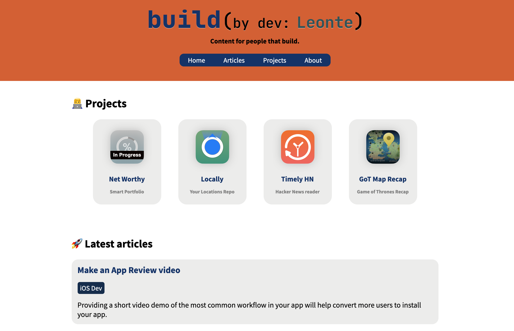

# Leonte.dev Publish project
## [www.leonte.dev](https://www.leonte.dev)

**Leonte.dev is my personal blog and portfolio website. It's a static website written in Swift and it's 100% free of JavaScript.**

Publish is a static site generator for Swift written by John Sundell.

Learn how to get started here: https://www.leonte.dev/articles/build-static-website-swift-john-sundell-publish/

#### Technologies used:
- Swift
- Publish: https://github.com/johnsundell/publish
- Ink: https://github.com/johnsundell/ink
- Plot: https://github.com/johnsundell/plot
- Splash: https://github.com/johnsundell/splash